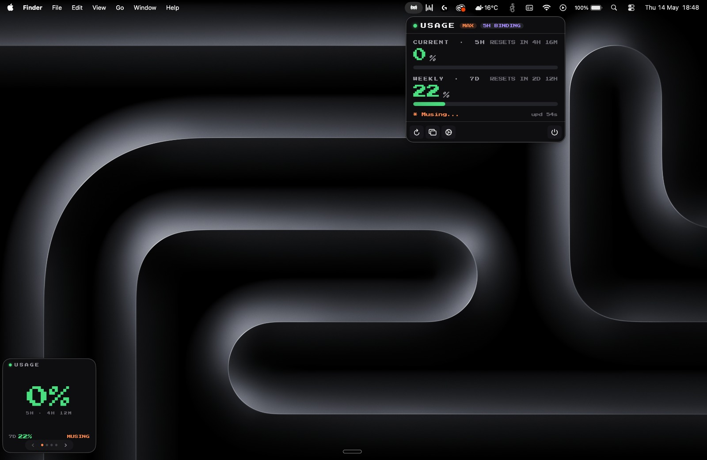

# ClawdBar

> Native macOS menu-bar app that shows your live Claude Code usage at a glance.

[](https://github.com/sponsors/rauppvj) [](https://www.buymeacoffee.com/rauppv) [](https://github.com/rauppvj/clawdbar/actions/workflows/ci.yml) [](./LICENSE)

ClawdBar polls Anthropic's Messages API once a minute with a 1-token Haiku ping, parses the `anthropic-ratelimit-unified-*` headers, and surfaces your **5 h session** and **7 d weekly** utilization in the menu bar — plus an optional floating overlay, threshold notifications, and a 7-day heatmap.



## Install

### Homebrew (recommended)

```bash
brew install --cask rauppvj/tap/clawdbar
```

### Direct download

Grab the latest `ClawdBar-x.y.z.dmg` from [Releases](https://github.com/rauppvj/clawdbar/releases), mount it, drag **ClawdBar.app** to **Applications**.

### First launch

ClawdBar isn't notarized with an Apple Developer ID yet, so macOS will refuse to open it on the first try. **Right-click → Open → Open** once. After that, double-click works normally.

If macOS says *"ClawdBar is damaged"* (some email clients strip signing metadata), run:

```bash
xattr -dr com.apple.quarantine /Applications/ClawdBar.app
```

The onboarding window will walk you through the keychain prompt and appearance.

## Uninstall

### If you installed via Homebrew

```bash
brew uninstall --cask clawdbar
```

Add `--zap` to also wipe preferences and the local history file in one shot:

```bash
brew uninstall --cask --zap clawdbar
```

### If you installed via the DMG

1. Quit ClawdBar (click the menu-bar icon → ⏻ button).
2. Drag **ClawdBar.app** from **/Applications** to the Trash.
3. (Optional) Clean up the leftover preferences and history:

   ```bash
   defaults delete com.vinicius.clawdbar
   rm -rf ~/.clawdbar ~/Library/Application\ Support/ClawdBar
   ```

### Login-item registration

If you enabled **Launch at login**, macOS keeps a service registration that removing the app *should* clean up automatically. If it lingers (rare), open **System Settings → General → Login Items & Extensions**, find ClawdBar, and remove it manually.

### Keychain access permission

ClawdBar's authorization to read the `Claude Code-credentials` keychain item is stored as a per-app ACL on that item. It's harmless once the app is gone, but if you want it gone too: open **Keychain Access**, search for `Claude Code-credentials`, double-click → **Access Control** tab → select ClawdBar in the always-allow list → **−**.

## Requirements

- **macOS 15** (Sequoia) or newer
- An active **Claude Code** login — run `claude /login` first so the OAuth token is in your macOS Keychain

### Supported plans

The 5 h + 7 d unified rate-limit system is the same across every Claude Code plan, so ClawdBar works the same way whether you're on:

- **Claude Pro** ($20/mo) — same headers, lower ceiling
- **Claude Max** — both 5× and 20× tiers; the popover header surfaces which
- **Claude Team** — also supported (limits per seat)

**Not yet supported:** Anthropic API direct (api keys from console.anthropic.com). That uses a different auth scheme (`x-api-key`) and a different rate-limit header family — see [CONTRIBUTING.md](./CONTRIBUTING.md) for the roadmap.

## How it works

The OAuth token lives at:

- Service: `Claude Code-credentials`
- Account: your macOS short username (`$USER`)
- Storage: `~/Library/Keychains/login.keychain-db`

ClawdBar reads it via `SecItemCopyMatching`, calls the Anthropic Messages API with the cheapest Haiku model and `max_tokens: 1`, then parses:

```
anthropic-ratelimit-unified-5h-utilization
anthropic-ratelimit-unified-5h-reset
anthropic-ratelimit-unified-7d-utilization
anthropic-ratelimit-unified-7d-reset
```

At the default 60-second poll interval, each day costs ≈ 1.4 k Haiku tokens — on the order of **US$ 0.0001/day** against your Anthropic account. Shown in the About tab.

## Privacy

- The OAuth token is read locally and only ever sent to `api.anthropic.com`.
- No telemetry, no analytics, no crash reporting.
- Local usage history lives at `~/.clawdbar/history.jsonl`.
- iCloud sync of any usage data is explicitly out of scope.

Don't take our word for it — audit instructions live in [CONTRIBUTING.md](./CONTRIBUTING.md#auditing-the-codebase). Four shell commands enumerate every dependency, network endpoint, and bundled asset.

## CLI probes

The same binary exposes non-UI commands for debugging:

```bash
ClawdBar --probe-credentials   # inspect keychain credentials (shape only)
ClawdBar --probe-api           # spend 1 Haiku token, dump anthropic-* headers
ClawdBar --reset-onboarding    # wipe UserDefaults
```

## Build from source

```bash
git clone https://github.com/rauppvj/clawdbar.git
cd clawdbar
./scripts/build-app.sh    # → dist/ClawdBar.app + dist/ClawdBar-x.y.z.dmg
open dist/ClawdBar.app
```

Or `open Package.swift` for the full Xcode workflow. Requirements and dev-signing details are in [CONTRIBUTING.md](./CONTRIBUTING.md).

## Known limitations

- **Token refresh.** Claude Code OAuth tokens have a ~5 h life; on 401 you'll need to re-run `claude /login`. Automatic refresh is on the roadmap.
- **Signing / notarization.** Builds are ad-hoc signed today, hence the right-click-Open dance on first launch. Apple Developer ID + notarization will land when the project graduates from dev preview.

Full troubleshooting matrix in [CONTRIBUTING.md](./CONTRIBUTING.md#troubleshooting).

## Support the project

If ClawdBar saves you context-switches, consider [sponsoring on GitHub](https://github.com/sponsors/rauppvj) or [buying me a coffee](https://www.buymeacoffee.com/rauppv). It's a one-person side project with zero ads, zero telemetry, and zero ambitions of becoming SaaS — sponsorships keep it that way.

## Acknowledgments

- [Press Start 2P](https://github.com/google/fonts/tree/main/ofl/pressstart2p) typeface by the Press Start 2P Project Authors — SIL OFL v1.1.

## License

MIT — see [LICENSE](./LICENSE). Press Start 2P retains its SIL OFL license; see `Sources/ClawdBar/Resources/Fonts/OFL.txt`.

**Unofficial. Not affiliated with Anthropic.**
