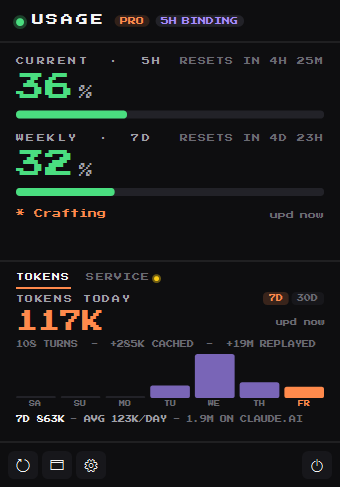
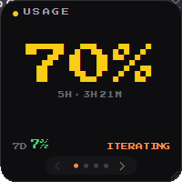
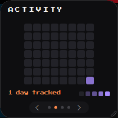
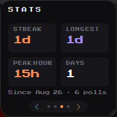
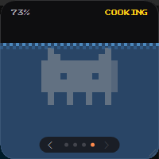
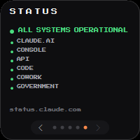
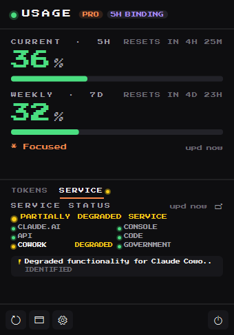

# ClawdBar for Windows

> Native Windows tray app that shows your live Claude Code usage at a glance.

A port of ClawdBar to Windows (C#, WinForms + GDI+), living alongside the macOS/SwiftUI
app in the same repo. Same idea, same design language, same 5 h / 7 d numbers — rebuilt
around the notification area instead of the macOS menu bar.

Everything here is self-contained under `windows/`. It shares no build with the Swift
package and the macOS CI workflow is untouched.

ClawdBar polls Anthropic's Messages API with a 1-token Haiku ping, parses the
`anthropic-ratelimit-unified-*` headers, and surfaces your **5 h session** and **7 d weekly**
utilization in the tray — plus a floating overlay, threshold notifications, a 7-day
activity heatmap, your **daily token spend**, and the live status of Anthropic's own
services.

| | |
|---|---|
|  |  |
| The tray panel | The floating widget |

## Requirements

- **Windows 10 or 11**
- **.NET Framework 4.x** — preinstalled on every supported Windows; nothing to download
- An active **Claude Code** login — run `claude /login` first

No .NET SDK, no NuGet, no Visual Studio. The app builds with the C# compiler that already
ships inside Windows and runs as a single self-contained `.exe` (font and icon embedded).

## Build

```cmd
build.cmd
```

That's it — output lands in `dist\ClawdBar.exe` (~260 KB). Double-click it, or run it from
a terminal. Look for the capybara in your notification area; Windows may tuck it into the
overflow ("^") on first run, so drag it onto the taskbar if you want it always visible.

## How it works

Claude Code on Windows stores its OAuth token at:

```
%USERPROFILE%\.claude\.credentials.json
```

ClawdBar reads that file directly — no permission prompt, because it is a file in your own
profile. If it is missing, Windows Credential Manager is checked for a generic credential
named `Claude Code-credentials` as a fallback.

It then calls the Messages API with the cheapest Haiku model and `max_tokens: 1`, and parses:

```
anthropic-ratelimit-unified-5h-utilization
anthropic-ratelimit-unified-5h-reset
anthropic-ratelimit-unified-7d-utilization
anthropic-ratelimit-unified-7d-reset
anthropic-ratelimit-unified-representative-claim
```

At the default 60-second interval each day costs roughly 1.4 k Haiku tokens — on the order
of **US$ 0.0001/day** against your Anthropic account.

### Supported plans

The unified 5 h + 7 d rate-limit system is the same across every Claude Code plan, so this
works on **Pro**, **Max** (5× and 20×) and **Team**.

The plan badge in the panel prefers what Claude Code records in
`%USERPROFILE%\.claude.json` (`oauthAccount.organizationType` /
`organizationRateLimitTier`) and falls back to the token's own `subscriptionType` claim.
That order matters: the token claims are minted at login and are **not** rewritten when the
token refreshes, so a Max 5× account can carry a token that still says `pro` months later.
The JSON file follows the account, so an upgrade shows up without a re-login. Preferences
→ Data Source names which of the two the badge is reading.

**Not supported:** direct Anthropic API keys from console.anthropic.com — different auth
scheme (`x-api-key`) and a different rate-limit header family.

## What's in it

- **Tray icon**, five styles: Numeric, Mini Bar, Mascot, Dual Bar, Hybrid
- **Panel** on left-click — both windows, reset countdowns, plan badge, which window is
  currently binding, refresh / overlay / preferences / quit
- **Token spend**, charted per day from Claude Code's own transcripts — a **TOKENS** tab
  in the panel, 7-day or 30-day
- **Service status** from status.claude.com behind a **SERVICE** tab, so a red number can
  be told apart from an Anthropic incident — also on its own overlay page
- **Floating widget** with five pages you page through with the chevrons:
  current usage, activity heatmap, stats, the tamagotchi where the capybara slowly
  drowns as you burn through your window, and service status
- **Preferences**: poll interval, launch at login, icon style, overlay opacity /
  click-through / snap corner / size lock, notification thresholds, API host and model
- **Threshold alerts** as tray notifications, with separate latches for 5 h and 7 d
- **Local history** at `%USERPROFILE%\.clawdbar\history.jsonl`, same JSON-Lines format as
  the macOS build — copy one across and your streaks come with it

| | | | |
|---|---|---|---|
|  |  |  |  |

### Daily token spend

The rate-limit bars answer "how close am I to the ceiling". They cannot answer "how much
did I actually burn today" — the headers carry a percentage, not a count. So the panel
grew a tab bar, and **TOKENS** leads it.

Claude Code already writes every turn to `%USERPROFILE%\.claude\projects\**\*.jsonl`,
`message.usage` block and all. ClawdBar rolls those up into daily totals: today's spend as
the headline, a 7-day or 30-day bar chart under it, and a readout line that swaps to
whichever bar the pointer is over. Entirely local — no credentials, no network, no API
call, nothing leaves the machine.

**The headline is input + output.** Cache reads run 97–99 % of the raw total on agentic
work, because every turn replays a context that was paid for once; leading with the total
makes an ordinary day read as tens of millions of tokens, which is true and useless. Cache
writes and cache reads are named in the caption instead, so all four counters stay on
screen and nothing is quietly folded into the big number.

**Two counts, both shown.** Claude Code writes one JSONL line per content block of a
response (`thinking`, `text`, `tool_use`) and every one of them repeats that response's
single `usage` block; resumed and forked sessions then replay those lines into the new
file. ClawdBar de-duplicates by (message id, request id), so its number is what was
actually generated — but claude.ai's own usage chart adds every record up, which runs
about 2.2× higher on this machine. The readout shows both rather than leaving you to find
the gap and conclude one of them is broken.

The scan is incremental: each transcript is remembered by (size, mtime, byte offset) and
only the new bytes are read, so a refresh after the first pass is a stat per file. A cold
pass over 580 MB of transcripts takes about 1.2 s here; a warm one 0.03 s. The cache lives
at `%USERPROFILE%\.clawdbar\tokens.json` and keeps 90 days.

Turn it off in **Preferences → Data Source → Token spend**; off means the tab disappears
and nothing under `.claude\projects` is ever opened.

### Service status

A 429 in ClawdBar looks the same whether you burned through your own window or Anthropic is
having a bad afternoon. ClawdBar reads the public
[status.claude.com](https://status.claude.com) feed every two minutes — one unauthenticated
GET of `api/v2/summary.json`, the same document the website renders — and shows the page
indicator, a dot per component and any unresolved incident in the panel and on the
overlay's fifth page. Clicking the arrow, an incident, or the overlay footer opens the page
itself.

No token and no usage data are sent to that host, and the snapshot survives a failed
refresh with a `STALE` tag rather than blanking. Turn the whole thing off in
**Preferences → Data Source → Service status**; off means zero requests to that host and no
status surfaces anywhere.



## CLI probes

```cmd
ClawdBar.exe --probe-credentials   :: inspect stored credentials (shape only, never the token)
ClawdBar.exe --probe-api           :: spend 1 Haiku token, dump every anthropic-* header
ClawdBar.exe --probe-status        :: fetch status.claude.com (no credentials, no tokens)
ClawdBar.exe --probe-tokens        :: roll local transcripts up into daily token totals
ClawdBar.exe --reset-onboarding    :: delete the settings file
ClawdBar.exe --help
```

These attach to the calling console. Redirect to a file if you launch them from something
other than a terminal.

## What changed from the macOS original

Ports are where the interesting decisions live. The behaviour differences, all deliberate:

| macOS | Windows | Why |
|---|---|---|
| Keychain via `SecItemCopyMatching`, with an approval prompt | `.credentials.json` read directly | That is where Claude Code puts the token on Windows. No prompt exists to walk the user through, so onboarding lost that step. |
| Wide menu-bar label (`S:12% W:34%`) | Square tray icon, numbers in the tooltip | A tray slot is square. Every style was re-laid out to fit; the full text moved to the tooltip. |
| Menu-bar mascot auto-tints (template image) | Mascot drawn in full colour | Windows has no template-image tinting. The tan body reads against both light and dark taskbars. |
| `SMAppService` login item | `HKCU\...\CurrentVersion\Run` value | The per-user, no-elevation equivalent. Moving the .exe breaks it — re-toggle after moving. |
| `UNUserNotificationCenter`, permission request | Tray balloon notifications | Real toasts without registering an AppUserModelID, which keeps the app a single portable .exe. No permission step needed. |
| Low Power Mode → 5× backoff | Battery saver → 5× backoff | Closest equivalent signal. |
| Sliders in Preferences | Numeric spinners | Sliders can't be themed dark in WinForms without owner-drawing every part; the per-row "reset to default" buttons survive. |
| `UserDefaults` | `%APPDATA%\ClawdBar\settings.json` | Same key names, so the two are easy to diff. |
| Token mirrored into a ClawdBar-owned keychain item | *not ported* | That feature exists to stop the macOS keychain prompting on every OAuth refresh. Windows has no prompt to stop: the token is a plain file in the user's own profile. A second copy would be risk without benefit. |
| Chart hover via `.help()` tooltips, text scaled with `minimumScaleFactor` | Readout line, one type size smaller | Same readout, but GDI+ has no text auto-scaling, and Press Start 2P is a fixed 8×8 grid — one size down is what fits three figures across 308 px. |
| Token dedup fingerprint: 64-bit FNV-1a | folded to 53 bits | The cache round-trips through this port's own JSON reader, whose numbers are doubles. 53 bits keeps a collision across a day's turns at about one in 20 billion, and the two caches are per-platform anyway. |
| `--export-icon` | *not ported* | It generated macOS `.icns` asset sizes. The Windows `.ico` is committed in `res\`. |

Two things were fixed rather than carried over:

- **"Show mascot" was a dead toggle** in the original — written to preferences, never read.
  Here it actually hides the capybara on the tamagotchi page.
- **Double-clicking the overlay's "next" arrow** advanced only one page, because the second
  click arrives as `WM_LBUTTONDBLCLK` and never reaches the click handler.

## Privacy

- The OAuth token is read locally and only ever sent to the configured API host.
- The status-page request is a plain unauthenticated GET: no token, no usage data, no
  identifiers. Switch it off in Preferences and the host is never contacted.
- No telemetry, no analytics, no crash reporting.
- Token spend is read from transcripts Claude Code already wrote and is never sent
  anywhere; the rollup cache stays on disk at `%USERPROFILE%\.clawdbar\tokens.json`.
- Usage history stays on disk at `%USERPROFILE%\.clawdbar\history.jsonl`.
- `--probe-credentials` prints token **length and an 8-character prefix**, never the token.

## Uninstall

1. Quit from the tray menu.
2. Delete `dist\ClawdBar.exe` (or the whole folder).
3. Optional cleanup:

```cmd
rmdir /s /q "%APPDATA%\ClawdBar"
rmdir /s /q "%USERPROFILE%\.clawdbar"
reg delete "HKCU\Software\Microsoft\Windows\CurrentVersion\Run" /v ClawdBar /f
```

The last line is only needed if you enabled "Launch at login".

## Layout

```
src\          the app (one namespace, no project file)
  Json.cs             hand-rolled JSON reader/writer — no package feed to pull from
  Models.cs           UsageData, Credentials, samples, derived stats, plan badge
  AppSettings.cs      JSON-backed preferences
  Services.cs         credential store, API client, history, login item, notifications
  UsageDaemon.cs      poll loop, credential cache, sleep/wake
  ServiceStatus.cs    status.claude.com snapshot: levels, components, incidents
  StatusMonitor.cs    status-page client and its own slow poll loop
  TokenUsage.cs       token counters, daily rollup, compact formatting
  TokenUsageScanner.cs  incremental transcript walk, dedup, on-disk cache, monitor
  AccountProfile.cs   oauthAccount out of %USERPROFILE%\.claude.json
  Theme.cs            palette, embedded font, shared GDI+ drawing
  Mascot.cs           the 16x16 procedural capybara
  TrayIconRenderer.cs tray bitmaps for the five styles
  PopupForm.cs        the tray panel
  OverlayForm.cs      the floating widget and its five pages
  SettingsForm.cs     preferences
  OnboardingForm.cs   first run
  Program.cs          entry point, CLI probes, tray context
tools\Preview.cs      dev harness: opens one window standalone for inspection
res\                  Press Start 2P (SIL OFL) + the app icon
build.cmd             builds the app
build-preview.cmd     builds the dev harness
```

### Dev harness

```cmd
build-preview.cmd
dist\Preview.exe popup       :: or: popup [tokens|status], settings [nav],
                            ::     onboarding, overlay [page]
```

Opens a single window against live data, without going through the tray. Quit ClawdBar
first so the two aren't both polling.

## License

MIT, same as the rest of the project — see [LICENSE](../LICENSE). Press Start 2P retains
its SIL OFL license; see `res\OFL.txt`.

**Unofficial. Not affiliated with Anthropic.**
